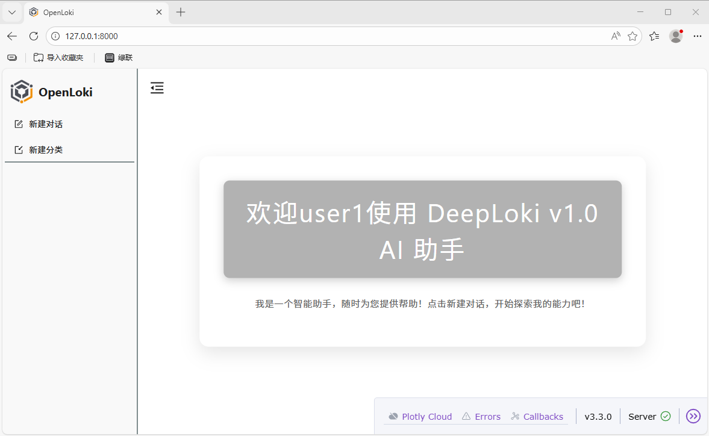
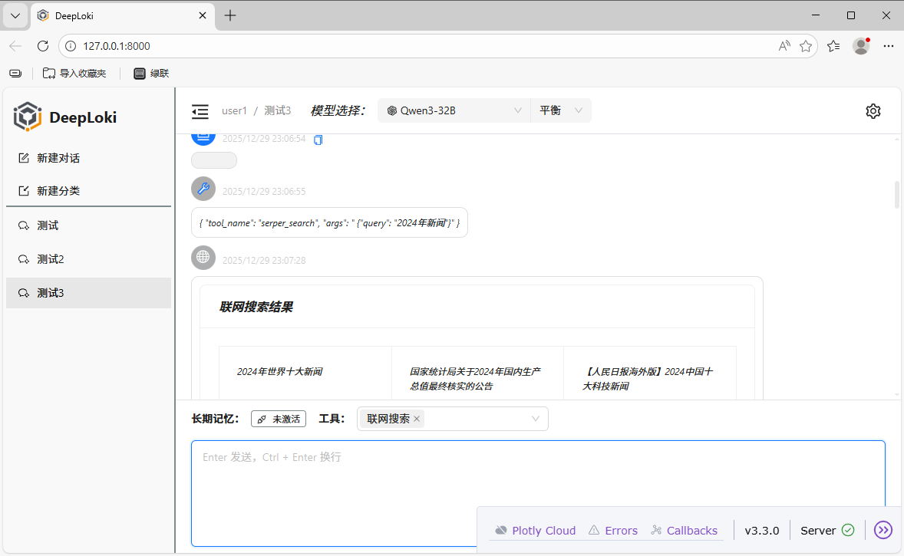
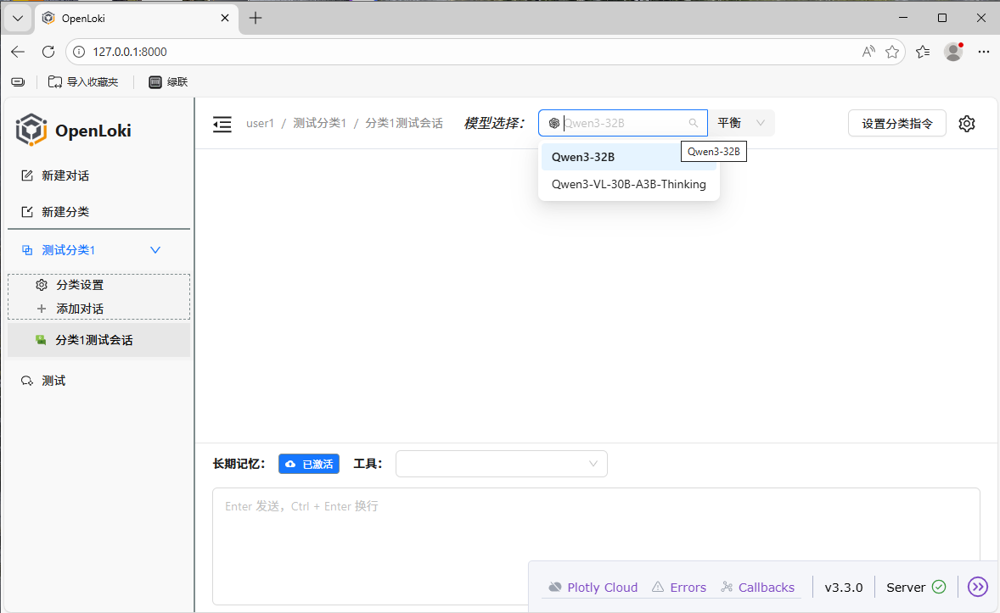
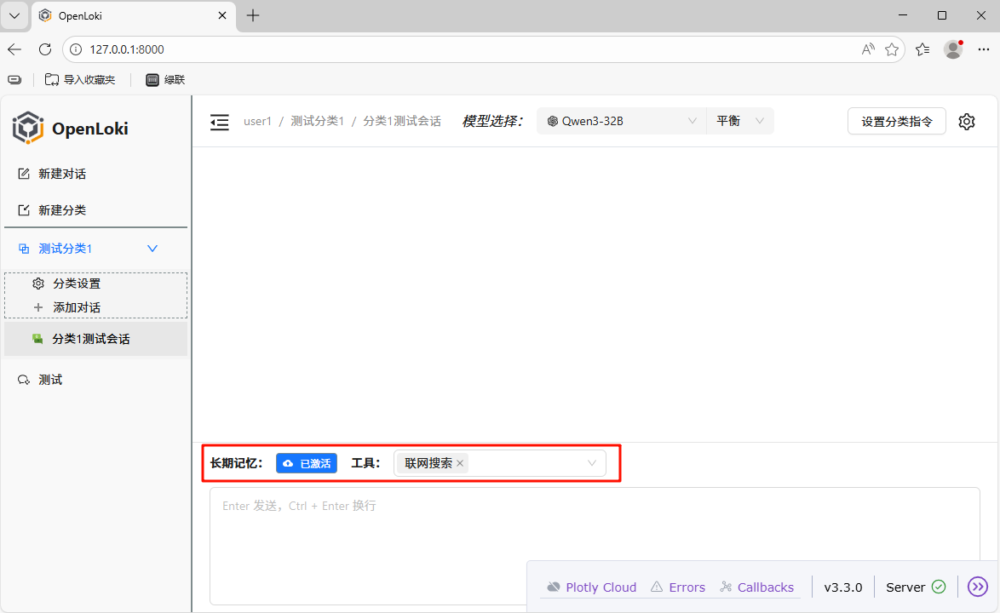
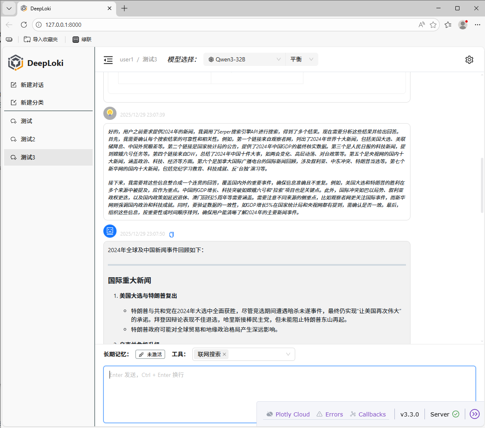
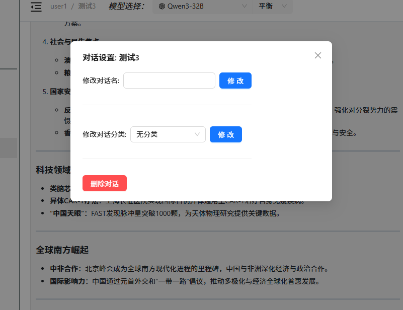

# OpenLoki

🔥🔥🔥开源AI对话平台OpenLoki，一个开箱即用的完全基于Python技术栈的AI Native Chat开发框架。

## 项目简介

OpenLoki是一个基于Python技术栈的AI对话平台，集成了现代AI应用开发所需的核心功能。项目采用前后端分离架构，前端使用Dash构建，后端基于FastAPI开发，支持多种LLM模型集成。

## 项目结构

```
OpenLoki/
├── fastapi_backend/           # FastAPI后端服务
│   ├── api/                  # API路由定义
│   ├── core/                 # 核心配置、中间件等
│   ├── database/             # 数据库相关
│   ├── models/               # 数据模型
│   ├── services/             # 业务服务层
│   ├── utils/                # 工具函数
│   └── app.py                # 后端主程序
├── dash_frontend/            # Dash前端界面
│   ├── assets/              # 静态资源（CSS、JS、图片等）
│   ├── blueprints/          # 蓝图模块
│   ├── callbacks/           # Dash回调函数
│   ├── components/          # UI组件
│   ├── utils/               # 工具函数
│   ├── views/               # 页面视图
│   └── app.py               # 前端主程序
├── script/                   # Windows启动脚本
│   ├── start_fastapi_backend.bat  # 后端启动脚本
│   └── start_dash_frontend.bat    # 前端启动脚本
├── config.toml               # 主配置文件
├── user_auth.toml            # 用户认证配置
├── pyproject.toml            # 项目依赖配置
├── requirements.txt          # 依赖包列表
└── README.md                 # 项目说明文档
```

## 配置文件说明

### config.toml（主配置文件）
项目的主要配置都集中在`config.toml`文件中：

1. **基础配置** (`[config]`):
   - `launch_mode`: 运行模式（dev/prod）
   - `log_level`: 日志级别
   - `jwt_secret_key`: JWT密钥
   - `frontend_port`: 前端端口（默认8000）
   - `backend_port`: 后端端口（默认8001）

2. **大模型配置** (`[llm.*]`):
   - `api_key`: 对应大模型的API密钥（如硅基流动API密钥）
   - `model_url`: 模型API地址
   - 支持配置多个大模型

3. **子智能体配置** (`[subagent.*]`):
   - 摘要模型相关配置

3. **短期记忆配置** (`[short_memory]`):
   - 对话历史长度配置

4. **长期记忆配置** (`[long_memory]`):
   - Memos记忆引擎配置

5. **MCP工具配置** (`[mcp]`):
   - 联网搜索等工具集成配置

### user_auth.toml（用户认证）
存储用户账号和密码信息，用于前端基础认证。

## 启动指南（Windows环境）

### 1. 准备工作
准备好Python环境，安装UV包管理器
```bash
pip install uv
```


### 2. 安装依赖
使用以下命令安装项目依赖：
```bash
uv sync
```

### 3. 配置文件更新
启动前需要更新以下配置文件：

**config.toml**:

1. 更新`api_key`字段：替换为你自己的大模型API密钥
2. 根据需要调整端口号（默认前端8000，后端8001）
3. 更新时间记忆等相关配置

**user_auth.toml**:

1. 修改默认用户名和密码
2. 可以添加更多用户账户

### 4. 启动项目

> 应用本身不存储任何数据，除了长期记忆依赖外部记忆API，其他数据全部存储在浏览器端持久化Storage

#### 方式一：使用批处理脚本（推荐）
1. **启动后端服务**：双击运行`script/start_fastapi_backend.bat`
   - 服务将在 `http://127.0.0.1:8001` 启动
   - 可以访问 `http://127.0.0.1:8001/docs` 查看API文档

2. **启动前端界面**：双击运行`script/start_dash_frontend.bat`
   - 界面将在 `http://127.0.0.1:8000` 启动

#### 方式二：手动启动
1. 启动后端：
```bash
cd fastapi_backend
python app.py
```

2. 启动前端：
```bash
cd dash_frontend
python server.py
```

### 5. 访问应用
1. 打开浏览器访问：`http://127.0.0.1:8000`
2. 使用`user_auth.toml`中配置的用户名和密码登录

## 功能特性

- 🔄 **多模型支持**: 支持配置多个LLM模型（Qwen系列等）
- 💾 **记忆系统**: 支持短期对话记忆和长期知识记忆
- 🔧 **工具调用**: 集成MCP工具，支持联网搜索等功能
- 📊 **可视化界面**: 使用Dash打造现代化的聊天界面
- 🛡️ **用户认证**: 基础HTTP认证机制
- 📁 **文件上传**: 支持文本文件上传和管理（todo）
- 📈 **日志系统**: 完整的日志记录和追踪

## 注意事项

1. **API密钥**: 需要自行申请硅基流动或其他大模型平台的API密钥
2. **端口冲突**: 如果8000或8001端口被占用，请在`config.toml`中修改端口配置
3. **依赖管理**: 推荐使用uv进行依赖管理，确保环境一致性
4. **生产部署**: 生产环境需要配置更安全的安全策略和密钥管理

## 开发建议

1. 开发建议使用Python 3.12+版本
2. 调试时可将`config.toml`中的`launch_mode`设置为`dev`
3. 日志文件默认保存在`logs/`目录下

|                |                  |
| ----------------------------------------- | ------------------------------------------------- |
|  |  |
|            |                      |
